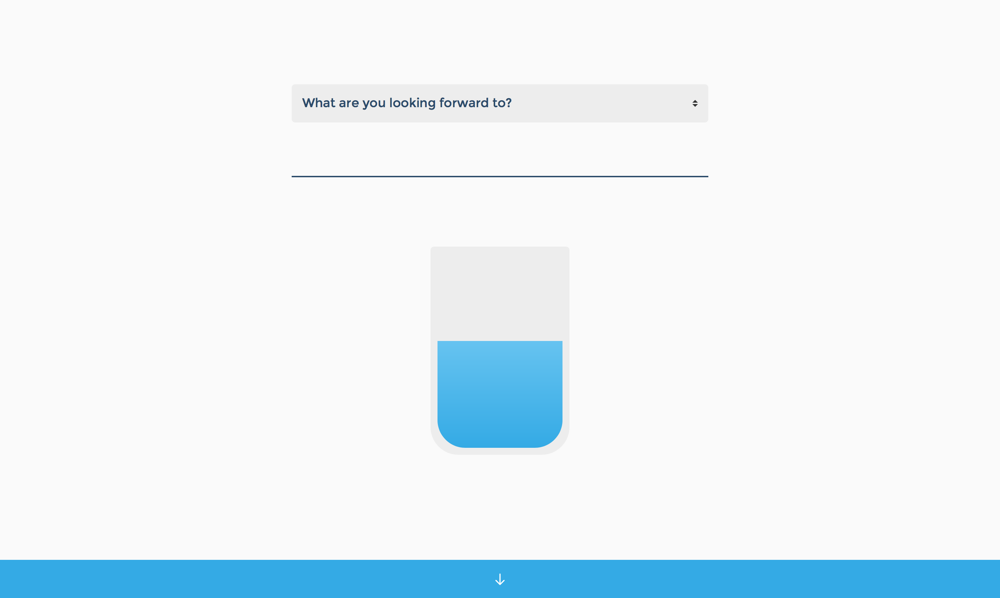

# Drops

Drops is a small web-app intended to help you notice and appreciate all the small things that make your life great and yet often go unnoticed in the daily hassle. Put it somewhere where you stumble upon it frequently – your browser's homepage or new tab page for example – to allow for short moments of mindfulness throughout your day.

## About the application

This application was designed during the HCI Master's program at Umeå University. The repository contains the (not that nice) source code for the prototype that was quickly hacked together in a few hours in order to evaluate the design by user testing.
